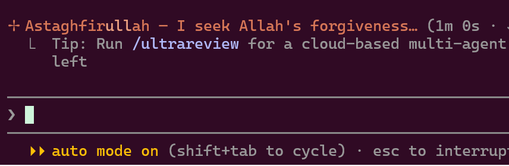
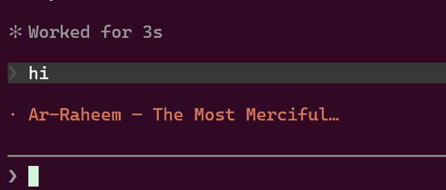
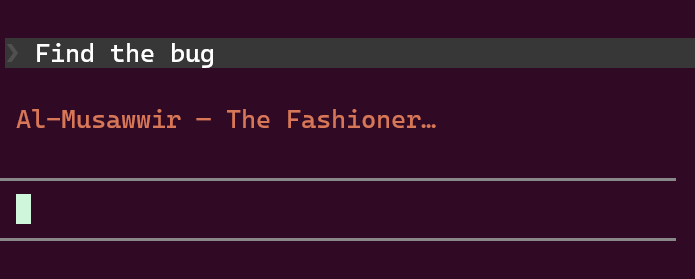

# claude-tasbih

[](https://github.com/hijam-git/claude-tasbih)
[](https://github.com/hijam-git)

Replace Claude Code's random spinner verbs ("Cogitating…", "Noodling…") with dhikr —
the tasbih phrases and the 99 Names of Allah (Asma-ul-Husna).

Every time Claude Code is thinking, you see something like:

<table>
  <tr>
    <td width="33%"></td>
    <td width="33%"></td>
    <td width="33%"></td>
  </tr>
</table>

## What's in here

| File | Purpose |
|---|---|
| `spinner-verbs.json` | The `spinnerVerbs` block to merge into your Claude Code settings |
| `README.md` | This file — install steps and the install prompt |
| `docs/` | Screenshots used above |

## Links

| | |
|---|---|
| Repo | https://github.com/hijam-git/claude-tasbih |
| Verbs file (browse) | https://github.com/hijam-git/claude-tasbih/blob/main/spinner-verbs.json |
| Verbs file (raw) | https://raw.githubusercontent.com/hijam-git/claude-tasbih/refs/heads/main/spinner-verbs.json |

## Install

### Option A — one prompt, no clone (recommended)

Paste this into Claude Code from **anywhere** — it fetches the verbs straight from
GitHub, no need to clone this repo.

> Fetch https://raw.githubusercontent.com/hijam-git/claude-tasbih/refs/heads/main/spinner-verbs.json
> and merge its top-level `spinnerVerbs` key into my Claude Code user settings at
> `~/.claude/settings.json` (on Windows: `C:\Users\<me>\.claude\settings.json`).
>
> Requirements:
> - Preserve every existing key in my settings file — do not drop or reorder my current
>   settings.
> - If a `spinnerVerbs` key already exists, replace it wholesale with the fetched one.
> - Write the file as UTF-8 **without a BOM** — the verbs contain em dashes (`—`) and
>   apostrophes that get corrupted into `â€"` if a tool reads or writes UTF-8 as ANSI.
>   Do not use Windows PowerShell 5.1 `Get-Content` / `Out-File` for this; use the Read
>   and Write tools, or `[IO.File]::ReadAllText` / `WriteAllText`.
> - Keep the result valid JSON (correct commas) and verify by parsing it after writing.
> - Confirm the verb count and tell me to restart Claude Code so it takes effect.

If the fetch is blocked or returns HTML instead of JSON, download the raw file yourself
and point Claude at the local path, or use Option B.

### Option B — let Claude Code do it from a clone

Clone this repo, open Claude Code inside it, and paste:

> Read `spinner-verbs.json` in this repo and merge its top-level `spinnerVerbs` key into
> my Claude Code user settings at `~/.claude/settings.json` (on Windows:
> `C:\Users\<me>\.claude\settings.json`).
>
> Requirements:
> - Preserve every existing key in my settings file — do not drop or reorder my current
>   settings.
> - If a `spinnerVerbs` key already exists, replace it wholesale with the one from
>   `spinner-verbs.json`.
> - Read and write the files as UTF-8 **without a BOM** — the verbs contain em dashes
>   (`—`) and apostrophes that get corrupted into `â€"` if a tool reads UTF-8 as ANSI.
>   Do not use Windows PowerShell 5.1 `Get-Content` / `Out-File` for this; use the Read
>   and Write tools, or `[IO.File]::ReadAllText` / `WriteAllText`.
> - Keep the result valid JSON (correct commas) and verify by parsing it after writing.
> - Show me a short diff of what changed, then tell me to restart Claude Code so the new
>   spinner verbs take effect.

Variants you can append to that prompt:

- **Append instead of replace** (keep Claude's built-in verbs too): "…and set
  `spinnerVerbs.mode` to `"append"`."
- **Project-only install:** "…merge into `.claude/settings.json` in the current project
  instead of my user settings."
- **Uninstall:** "Remove the `spinnerVerbs` key from my Claude Code settings, keep every
  other key intact, verify the file still parses, and remind me to restart."

### Option C — edit settings.json directly

Yes, editing `settings.json` by hand is perfectly fine — it is the same result, and
there is no separate install step or CLI for spinner verbs. The prompt options are only
better because Claude does the JSON merge and comma bookkeeping for you.

1. Open the [raw verbs file](https://raw.githubusercontent.com/hijam-git/claude-tasbih/refs/heads/main/spinner-verbs.json)
   and copy it.
2. Open your user settings file:
   - Windows: `C:\Users\<you>\.claude\settings.json`
   - macOS / Linux: `~/.claude/settings.json`
3. Paste the `"spinnerVerbs": { ... }` object in as a **top-level key**, alongside your
   existing keys.
4. Mind the commas — the file must stay valid JSON. Example result:

```json
{
  "model": "opus[1m]",
  "tui": "fullscreen",
  "spinnerVerbs": {
    "mode": "replace",
    "verbs": ["SubhanAllah — Glory be to Allah", "..."]
  }
}
```

5. Save as **UTF-8 without BOM** (see the Encoding section below).
6. Restart Claude Code (`/exit`, then relaunch). The spinner picks a random verb per turn.

## Settings reference

- `mode`
  - `"replace"` — use **only** these verbs (default here)
  - `"append"` — add these on top of Claude Code's built-in verbs
- `verbs` — array of strings. 104 entries here: 5 core dhikr phrases followed by the
  99 Names with English meanings.

Settings precedence, if you want it scoped differently:

| File | Scope |
|---|---|
| `~/.claude/settings.json` | You, everywhere (recommended) |
| `<project>/.claude/settings.json` | One project, shared via git |
| `<project>/.claude/settings.local.json` | One project, just you (gitignored) |

## Encoding: the `â€"` problem

If your verbs show up as `SubhanAllah â€" Glory be to Allah`, the file was written by a
tool that read UTF-8 bytes as Windows-1252. The em dash `—` is three bytes (`E2 80 94`)
in UTF-8; misread as ANSI they become the three characters `â€"`.

Rules that avoid it:

- Save `settings.json` as **UTF-8, no BOM**. In VS Code the status bar should read
  `UTF-8` (not `UTF-8 with BOM`, not `Windows 1252`).
- On Windows PowerShell **5.1**, `Get-Content` defaults to ANSI and `Out-File -Encoding utf8`
  writes a BOM — both break this file. Use `[IO.File]::ReadAllText(path)` and
  `[IO.File]::WriteAllText(path, text, (New-Object Text.UTF8Encoding $false))`, or use
  PowerShell 7+, or just edit in an editor.
- Once corrupted, the text is genuinely changed on disk — re-save won't fix it. Re-copy
  the verbs from `spinner-verbs.json`.
- If you'd rather sidestep all of this, replace every `—` with a plain ASCII hyphen `-`.
  It looks slightly plainer in the terminal but is immune to encoding mishaps.

## Customising

Edit the `verbs` array freely — add salawat, du'a, or ayah fragments. Keep each line
short (roughly under 45 characters) so it doesn't wrap in a narrow terminal.

To go back to the defaults, delete the `spinnerVerbs` key and restart.

## Notes

- Transliterations use a simple Latin scheme without diacritics for terminal safety.
- Purely cosmetic — no effect on Claude Code's behaviour, permissions, or billing.

## Support this project

If the dhikr spinner brought a bit of barakah to your terminal:

- ⭐ **[Star the repo](https://github.com/hijam-git/claude-tasbih)** — it helps other
  Muslim developers find it.
- 👤 **[Follow @hijam-git](https://github.com/hijam-git)** for more Claude Code tweaks.
- 🐛 Open an issue or PR with corrections to any transliteration or meaning — accuracy
  matters more than speed here.

Jazakum Allahu khayran.
